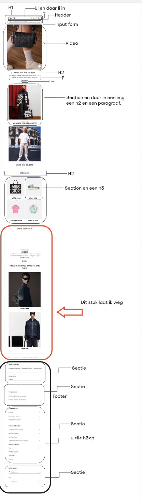
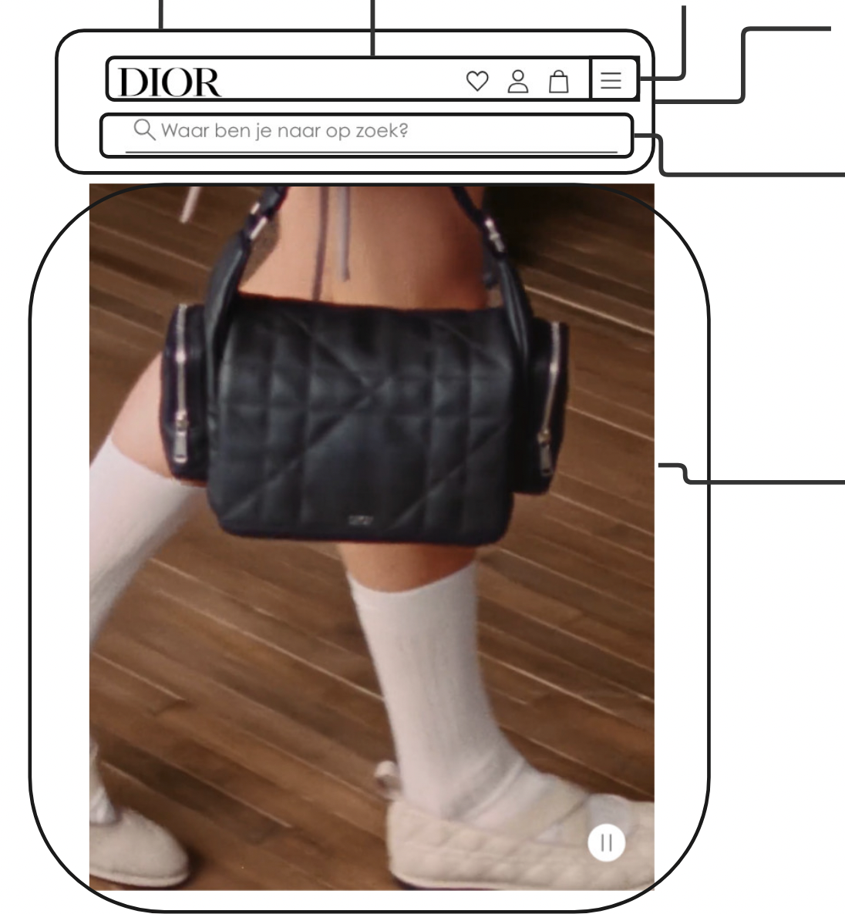
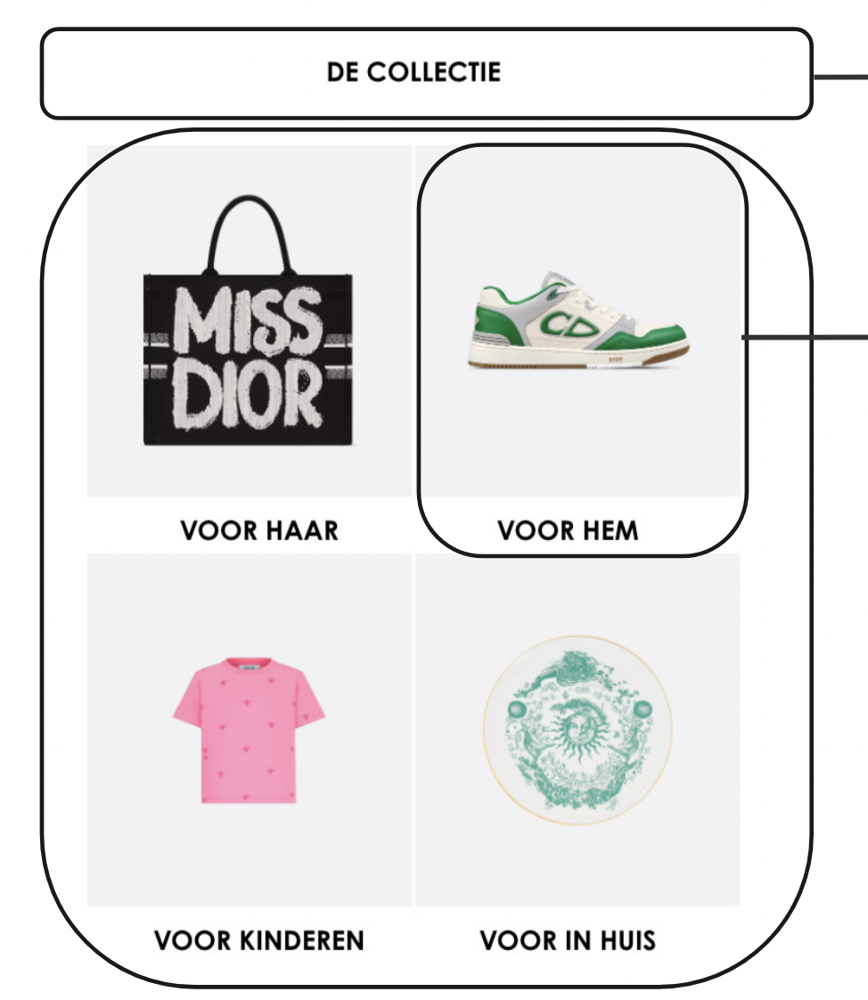
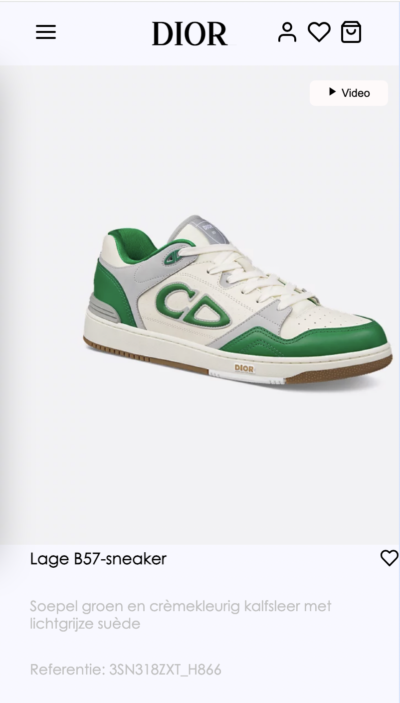
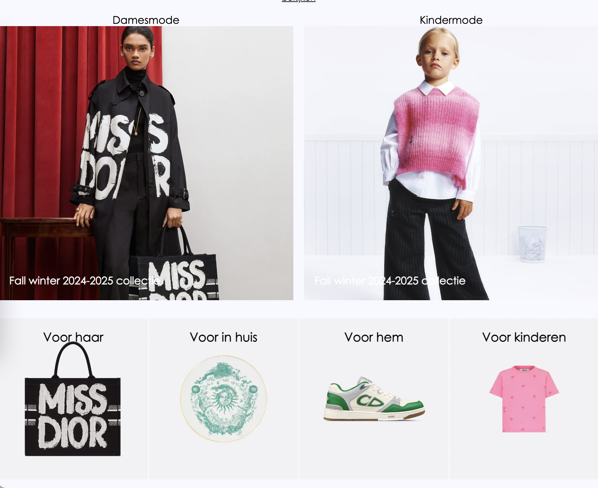
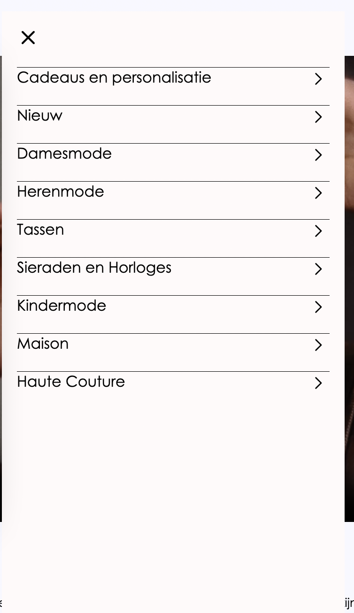

# Procesverslag
Markdown is een simpele manier om HTML te schrijven.  
Markdown cheat cheet: [Hulp bij het schrijven van Markdown](https://github.com/adam-p/markdown-here/wiki/Markdown-Cheatsheet).

Nb. De standaardstructuur en de spartaanse opmaak van de README.md zijn helemaal prima. Het gaat om de inhoud van je procesverslag. Besteedt de tijd voor pracht en praal aan je website.

Nb. Door *open* toe te voegen aan een *details* element kun je deze standaard open zetten. Fijn om dat steeds voor de relevante stuk(ken) te doen.

## Jij

  
uitwerken voor kick-off werkgroep

  ### Auteur:
 Mines Yetim

  #### Je startniveau:
  Blauw

  #### Je focus:
  Responsive
 

## Je website

  
uitwerken voor kick-off werkgroep

  ### Je opdracht:
  Ik ga de website van Dior namaken.  https://www.dior.com/nl_nl

  #### Screenshot(s) van de eerste pagina (small screen): 
  Homepagina. 
  

  #### Screenshot(s) van de tweede pagina (small screen):
  hier de naam van de pagina  
  
 

## Toegankelijkheidstest 1/2 (week 1)

  
uitwerken na test in 2e werkgroep

  ### Bevindingen
  Lijst met je bevindingen die in de test naar voren kwamen:
- de html is niet juist geschreven er zitten veel divs en classes in. Hij geeft gelijk een foutmelding als je hem 
door de w3C validator haalt.
- De video speelt door op de autoplay 
- de buttons zien er niet alijd uit als linkjes op de website
- De website heeft geen darkmodus

## Breakdownschets (week 1)

  
uitwerken na afloop 3e werkgroep

  ### de hele pagina: 
  

  ### dynamisch deel (bijv menu): 
  

  ### wellicht nog een dynamisch deel (bijv filter): 
  

## Voortgang 1 (week 2)

  
uitwerken voor 1e voortgang

  ### Stand van zaken
  hier dit ging goed & dit was lastig (neem ook screenshots op van delen van je website en code)
  
- Voor de eerste groep had ik enkel de structuur van mijn html nog en enkel en paar regels CSS. 

  ### Agenda voor meeting
  samen met je groepje opstellen

  | student 1      | student 2          
  | Hoe de semantiek Vragen of we de body samen kunnen CSSen zodat dat alvast goed is.
  is van onze HTMl 
  pagina 
  

  ### Verslag van meeting
  hier na afloop snel de uitkomsten van de meeting vastleggen

  - Html is ok 
  - Volgende voortgang meer regels css hebben zodat we ook daar over in gesprek kunnen 
  - Zorgen dat je een h2 in je pagina hebt.
  - 

## Voortgang 2 (week 3)

  
uitwerken voor 2e voortgang

  ### Stand van zaken
  hier dit ging goed & dit was lastig (neem ook screenshots op van delen van je website en code)

  ### Agenda voor meeting
  samen met je groepje opstellen

  | student 1      | student 2          | student 3    | student 4        |
  | ---            | ---                | ---          | ---              |
  | dit bespreken  | en dit             | en ik dit    | en dan ik dat    |
  | en dat ook nog | dit als er tijd is | nog een punt | dit wil ik zeker |
  | ... 
  
  - we waren deze voortgang enkel met zijn 3 Mehmet, Safira en ik 
  We wilden bespreken of we jusite CSS gebruikten en hoe we een aantal elementen het best konden 
  positioneren. We hadden wat struggles met onze hamburger menu of we dit gezamelijk konden oplossen 

  ### Verslag van meeting
  hier na afloop snel de uitkomsten van de meeting vastleggen

  - Geen vieze code gebruiken!
  - Werken met flexbox
  - dingen in een grid zetten, zoek dit op op internet dat mag!
- ...

## Toegankelijkheidstest 2/2 (week 4)

  
uitwerken na test in 9e werkgroep

  ### Bevindingen
  Lijst met je bevindingen die in de test naar voren kwamen (geef ook aan wat er verbeterd is):

  - in de footer heb ik een hover effect toegevoegd. 
  - Ik gebruik goede ALT.
  - Ik gebruik een ul en li waar het moet
  - Buttons zien eruit als buttons
  - Ik moet nog een darkmodus toevoegen
  - Ik werk met een root dit gaat goed! was wel even wennen.

## Voortgang 3 (week 4)

  
uitwerken voor 3e voortgang

  ### Stand van zaken
  hier dit ging goed & dit was lastig (neem ook screenshots op van delen van je website en code)

- Vandaag waren we weer met zijn 3 Mehmet, Safira en ik. Tijdens deze feedback ronde zijn we erachter gekomen dat we gewoon flink moeten door typen. We waren al goed bezig alleen moesten we gewoon de uitdagingen aan gaan en als iets niet lukte het gewoon proberen op andere manieren. We kwamen erook achter dat hoe meer we gingen CSSen hoe betet we bepaalde elementen moesten aanspreken. Hier kwamen we soms door in de problemen.
Deze voortgang hebben we het meest over svg's gehad. 

  ### Agenda voor meeting
  samen met je groepje opstellen

  | student 1      | student 2          | student 3    | student 4        |
  | ---            | ---                | ---          | ---              |
  | dit bespreken  | en dit             | en ik dit    | en dan ik dat    |
  | en dat ook nog | dit als er tijd is | nog een punt | dit wil ik zeker |
  | ...            | ...                | ...          | ...              |

  ### Verslag van meeting
  hier na afloop snel de uitkomsten van de meeting vastleggen

  - Meer gaan proberen en gewoon blijven typen! geef niet op.
  - Elementen kunnen overelkaar met een position relative en position absolute
  - Zorg dat alle linkjes en buttons hoverbaar is. 
  - Maak er iets van waar je trots op bent. 

## Eindgesprek (week 5)

  
uitwerken voor eindgesprek

  ### Je uitkomst - karakteristiek screenshots:
  

  ### Dit ging goed/Heb ik geleerd: 
  Eigenlijk, heb ik alles van het begin geleerd. Tijdens deze inhaalklas ben ik erachter gekomen dat ik helemaal
  niet zo heel slecht ben in code. Alleen denk ik dat ik tijdens de vorige codeervakken mezelf demotiveerde omdat ik het gewoon lastig vond. Nu heb ik gewoon iedere les meegedaan en optijd begonnen met mijn website waardoor ik optijd hulp kon vragen bij dingen waar ik tegenaan liep, en als dit was gelukt motiveerde dit ook weer.
  Ik ben het meest trots op het responsive gedeelte dat als je het scherm groter maakt mijn elementen bewegen. 

  

  ### Dit was lastig/Is niet gelukt:
  Korte omschrijving met plaatjes

  Wat ik het lastigst vond was mijn header in orde maken. Ik vond het lastig deze te positioneren en met meerdere plaatjes. Vaak ging die stuk of werkte hij niet. 
  Ik heb mijn navigatie daarom heel simpel gehouden, ik was namelijk al blij dat hij werkt haha. 

  

## Bronnenlijst

  
continu bijhouden terwijl je werkt

  Nb. Wees specifiek ('css-tricks' als bron is bijv. niet specifiek genoeg). 
  Nb. ChatGpT en andere AI horen er ook bij.
  Nb. Vermeld de bronnen ook in je code.

  1. codepen uitwerkingen van Sanne die we in de les maakten. 
  2. Ik heb voor een aantal dingen Chatgpt gebruikt. ( bij het maken van svg's bijvoorbeeld.)
  3. Ik heb soms hulp gehad van mede studenten.

